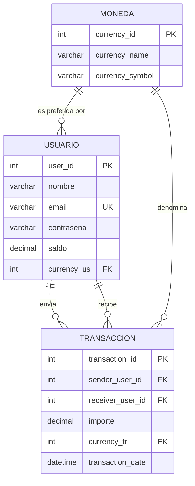

## Entregables
Se debe entregar un documento en formato Word que contenga lo siguiente:
### Consultas SQL
Se incluirán todas las sentencias SQL utilizadas para crear y manipular la base de datos del Virtual Wallet.
### Captura de pantalla
Se adjuntará una foto (captura de pantalla) que muestre los primeros resultados obtenidos al ejecutar los queries.
El documento debe estar claramente organizado y etiquetado para evidenciar el proceso de implementación y los resultados obtenidos.
### Portafolio
Subir el entregable del proyecto "Alke Wallet" al portafolio. Asegúrate de presentar el proyecto "Alke Wallet" de manera clara, concisa y atractiva, destacando tus contribuciones y los aspectos más relevantes del proyecto.

## Creación base de datos
```sql
CREATE DATABASE IF NOT EXISTS AlkeWallet
  CHARACTER SET utf8mb4 COLLATE utf8mb4_unicode_ci;
  ```
## Activación base de datos
```sql
USE AlkeWallet;
```
## Creación de tablas
### Tabla moneda
```sql
CREATE TABLE moneda(
	currency_id int PRIMARY KEY,
	currency_name varchar(50) NOT NULL,
	currency_symbol varchar(50) NOT NULL
);
```
### Tabla usuarios
```sql
CREATE TABLE usuario(
	user_id int AUTO_INCREMENT PRIMARY KEY,
	nombre varchar(50) NOT NULL,
	email varchar(50) NOT NULL,
	password varchar(50) NOT NULL,
	saldo int,
	currency_us int,
	CONSTRAINT fk_usuario_moneda FOREIGN KEY (currency_us) REFERENCES moneda(currency_id)
);
```
### Tabla transaccion
```sql
CREATE TABLE transaccion(
	transaction_id int AUTO_INCREMENT PRIMARY KEY,
	sender_user_id int,
	receiver_user_id int,
	importe int NOT NULL,
	transaction_date date NOT NULL,
	currency_tr int,
	CONSTRAINT fk_transaccion_sender FOREIGN KEY (sender_user_id) REFERENCES usuario(user_id),
	CONSTRAINT fk_transaccion_receiver FOREIGN KEY (receiver_user_id) REFERENCES usuario(user_id),
	CONSTRAINT fk_transaccion_moneda FOREIGN KEY (currency_tr) REFERENCES moneda(currency_id)
);
```
## Diagrama Entidad-Relación

## Poblado de tablas
### Tabla moneda (3 diferentes)
```sql
INSERT INTO moneda (currency_id, currency_name, currency_symbol) VALUES
(1, 'Peso Chileno', 'CLP$'),
(2, 'Dólar Estadounidense', 'USD$'),
(3, 'Euro', 'EUR$')
ON DUPLICATE KEY UPDATE currency_name=VALUES(currency_name);
```
### Tabla usuario (100 diferentes por recursividad de MySQL8)
```sql
INSERT INTO usuario (nombre, email, password, saldo, currency_us)
WITH RECURSIVE generador_usuarios AS (
    SELECT 1 AS n
    UNION ALL
    SELECT n + 1 FROM generador_usuarios WHERE n < 100
)
SELECT 
    CONCAT('Usuario ', n) AS nombre,
    CONCAT('user', n, '@ankewallet.com') AS email,
    CONCAT('pass', FLOOR(1000 + (RAND() * 9000))) AS password, -- Clave aleatoria de 4 dígitos
    FLOOR(5000 + (RAND() * 95000)) AS saldo,                    -- Saldo inicial entre 5,000 y 100,000
    FLOOR(1 + (RAND() * 3)) AS currency_us                      -- Asigna moneda 1, 2 o 3 al azar
FROM generador_usuarios;
```
### Tabla transaccion (80 diferentes automáticas y aleatorias)
```sql
INSERT INTO transaccion (sender_user_id, receiver_user_id, importe, transaction_date, currency_tr)
WITH RECURSIVE generador_transacciones AS (
    SELECT 1 AS n
    UNION ALL
    SELECT n + 1 FROM generador_transacciones WHERE n < 80
)
SELECT 
    -- Genera un emisor entre el usuario 1 y 50
    FLOOR(1 + (RAND() * 50)) AS sender_user_id,
    -- Genera un receptor entre el usuario 51 y 100 (para evitar que se envíe a sí mismo)
    FLOOR(51 + (RAND() * 49)) AS receiver_user_id,
    -- Importe de la transferencia entre 100 y 20000
    FLOOR(100 + (RAND() * 19900)) AS importe,
    -- Fecha aleatoria dentro de los últimos 30 días
    DATE_SUB(CURDATE(), INTERVAL FLOOR(RAND() * 30) DAY) AS transaction_date,
    -- Moneda de la transferencia al azar (1, 2 o 3)
    FLOOR(1 + (RAND() * 3)) AS currency_tr
FROM generador_transacciones;
```
## Pantallazos de consola
### Tabla moneda

### Tabla usuario

### Tabla transaccion

## Consultas
### 1. Consulta para obtener el nombre de la moneda elegida por un usuario especifico.
```sql
SELECT currency_name FROM moneda
WHERE currency_id =(
    SELECT currency_us FROM usuario
    WHERE user_id=76 -- Se debe ingresar el user_id del usuario específico.
    );
```

### 2. Consulta para obtener todas las transacciones registradas.
```sql
SELECT t.transaction_date AS 'Fecha',
u1.nombre  AS 'Emisor',
u2.nombre AS 'Receptor',
t.importe AS 'Monto'
FROM transaccion t 
JOIN usuario u1 ON t.sender_user_id=u1.user_id
JOIN usuario u2 ON t.receiver_user_id=u2.user_id
ORDER BY t.transaction_date ASC;
```


### 3. Consulta para obtener todas las transacciones realizadas por un usuario especifico.

#### Para probar el código, se insertan 4 registros (2 veces):
 ```sql
INSERT INTO transaccion(sender_user_id, receiver_user_id, importe, transaction_date, currency_tr)
VALUES (3,19,700,'2026-06-15',1),
(25,19,1250,'2026-06-15',2),
(21,19,1000,'2026-06-15',2),
(72,19,450,'2026-06-15',3);

SELECT 
    t.transaction_date AS 'Fecha',
    u1.nombre AS 'Emisor',
    u2.nombre AS 'Receptor',
    c.currency_symbol AS 'Moneda',
    t.importe AS 'Monto'
FROM transaccion t
JOIN usuario u1 ON t.sender_user_id = u1.user_id
JOIN usuario u2 ON t.receiver_user_id = u2.user_id
JOIN moneda c ON t.currency_tr = c.currency_id
WHERE t.sender_user_id = 19 OR t.receiver_user_id = 19 --Se debe ingresar el user_id del usuario específico.
ORDER BY Fecha ASC;
```


### 4. Sentencia DML para modificar el campo correo electrónico de un usuario especifico.
```sql
-- Antes
SELECT * FROM usuario
WHERE user_id=7;
--Después
UPDATE usuario
SET email="us07@alke.cl"
WHERE user_id=7;
```

### 5. Sentencia para eliminar los datos de una transaccion (eliminado de la fila completa)
```sql
-- Antes
SELECT user_id, nombre, email, saldo
FROM usuario
ORDER BY user_id DESC
LIMIT 10;
```


#### Primero se eliminan las transacciones del usuario y luego se elimina al usuario, manteniendo la integridad referencial.
```sql
--Después
DELETE FROM transaccion
WHERE sender_user_id=98 OR receiver_user_id=98; --Debe indicar usuario a eliminar.

DELETE FROM usuario
WHERE user_id=98;
```


