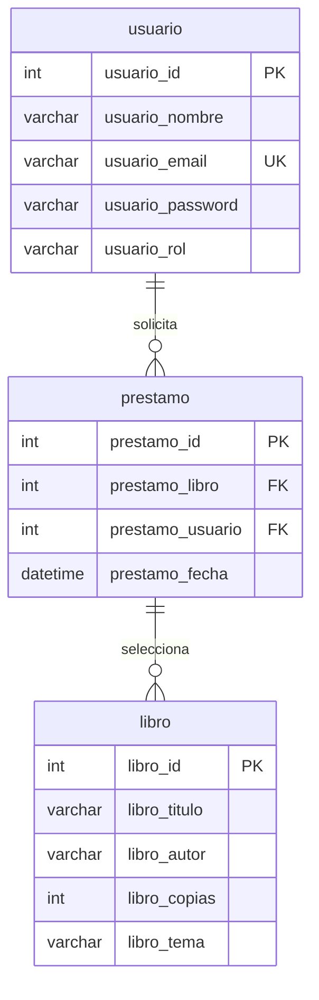

# Proyecto: SpringEduManager
## Evaluación del módulo 6: Desarrollo de aplicaciones JEE con Spring framework
### Problema
Unidad solicitante: Coordinación Académica de un bootcamp de programación. El área académica ha detectado que los estudiantes tienen dificultades para organizar sus cursos, prácticas y evaluaciones en una sola plataforma. Actualmente, utilizan hojas de cálculo y formularios aislados. 
- El equipo técnico debe desarrollar una aplicación web interna que permita a los estudiantes 
    - registrarse, 
    - visualizar sus cursos, 
    - ver sus prácticas y 
    - consultar sus evaluaciones. 
- Esta aplicación servirá también como base para futuros módulos, integrándose con otros sistemas del campus.
### Objetivo
Desarrollar progresivamente una aplicación web educativa en Java utilizando el ecosistema de Spring (Spring Boot, Spring MVC, Spring Data JPA, Spring Security, REST) que permita gestionar estudiantes, cursos y evaluaciones. El proyecto se realizará en etapas y cada entrega corresponderá a una lección del módulo, asegurando la integración continua del sistema.
### Requerimientos
- Uso de Maven como gestor de dependencias.
- Arquitectura basada en MVC con Spring Boot.
- Persistencia de datos con JPA y H2 o MySQL.
- Seguridad de acceso con Spring Security.
- Exposición de APIs RESTful.
### Aspectos a alidar
1. Estructura y modularización del proyecto según buenas prácticas.
2. Uso adecuado de Maven y confi guración de dependencias.
3. Implementación funcional y estructurada del patrón MVC.
4. Persistencia y manipulación de datos desde base de datos con JPA.
5. Confi guración segura con roles y login/logout.
6. Exposición de servicios RESTful con respuesta en JSON.
7. Coherencia entre entregas y evolución progresiva del proyecto.
### Entregables
1. Repositorio Git con el proyecto completo y documentación (README.md)
2. Evidencias funcionales: capturas de pantalla, video breve, o link a repositorio
3. Proyecto estructurado con:
    - Controladores, servicios, repositorios
    - Seguridad confi gurada
    - APIs REST funcionales
    - Formularios web operativos
### Portafolio
Podrás incorporar este proyecto en tu portafolio como ejemplo de una aplicación web completa con seguridad, base de datos y servicios REST. Se recomienda:
- Documentar en tu GitHub cada etapa del proyecto.
- Incluir en tu CV un enlace directo al proyecto.
- Adjuntar capturas del funcionamiento e indicar tecnologías utilizadas (Maven, Spring Boot, JPA, Spring Security, REST).
## Paso a paso
### Lección 1
- Objetivo.
    - Utilizar un gestor de proyectos para la administración del ciclo de vida de un proyecto Spring
- Tareas a desarrollar.
    - Crear un nuevo proyecto Spring Boot usando Maven desde https://start.spring.io
    - Configurar el archivo pom.xml con las dependencias necesarias para futuras lecciones (spring-boot-starter-web, spring-boot-starter-data-jpa, spring-boot-starter-security, h2 o mysql-connector-java).
    - Ejecutar los comandos clean, install y package desde consola para verifi car el ciclo de vida del proyecto.
    - Subir el proyecto a GitHub (opcional).
### Lección 2
- Objetivo.
    - Utilizar Spring Boot y Spring MVC para la implementación de una aplicación web básica
- Tareas a desarrollar.
    - Implementar el patrón MVC: crear las entidades Estudiante y Curso con sus respectivos controladores y vistas.
    - Crear formularios en HTML (JSP o Thymeleaf) para ingresar datos de estudiantes y cursos.
    - Configurar rutas básicas con anotaciones @Controller y @GetMapping, @PostMapping.
    - Mostrar una lista de cursos y estudiantes en la interfaz.
### Lección 3
- Objetivo.
    -Implementar la capa de acceso a datos en una aplicación web utilizando Spring Framework
- Tareas a desarrollar.
    - Crear repositorios JPA (EstudianteRepository, CursoRepository) que extiendan JpaRepository.
    - Confi gurar una base de datos embebida (H2) o MySQL.
    - Utilizar @Service e @Repository para implementar la lógica de negocio.
    - Persistir y consultar registros desde los formularios creados en la lección anterior.
### Lección 4
- Objetivo.
    - Implementar mecanismos de seguridad utilizando Spring Security para controlar el acceso a los recursos del aplicativo
- Tareas a desarrollar.
    - Agregar la dependencia de Spring Security.
    - Configurar usuarios en application.properties.
    - Proteger rutas según roles (ADMIN, USER) usando @PreAuthorize o confi guración en SecurityConfi g.
    - Crear un formulario de login y logout funcional.
    - Proteger la vista de carga de datos para que solo los usuarios con rol ADMIN puedan ingresar nuevos cursos.
### Lección 5
- Objetivo.
    - Utilizar Spring Framework para la disponibilización de un servicio REST que da solución a un problema de interoperabilidad
- Tareas a desarrollar.
    - Crear controladores REST (@RestController) para exponer datos de estudiantes y cursos
    - Usar @GetMapping, @PostMapping, @PutMapping, @DeleteMapping para exponer operaciones CRUD.
    - Validar el consumo del endpoint desde Postman o con un cliente externo mediante RestTemplate.
    - Asegurar los endpoints REST con JWT (opcional como parte del plus).

# Desarrollo
**Nota para la revisión**: El proyecto fue desarrollado utilizando un entorno local de MariaDB configurado en el **puerto 3307** (considerarlo al ejecutar programa).

## Metodología.
1. Creación de proyecto dinámico en IDE Eclipse.
2. Aplicación MVC.
    1. Creación de base de datos y tablas en MariaDB.
    2. desarrollo JAVA.
        - Conexión modelo y base de datos MariaDB (JDBC).
        - Desarrollo de entidades (modelo).
        - Desarrollo clases DAO.
        - Creación de SERVLET (Controlador).
        - Desarrollo de JSP (Vista).
        - Pruebas finales.
    3. Documentación
### Creación de base de datos y tablas en MariaDB.
#### Diagrama Entidad-Relación

- **precarga_untec.sql**: creación de base de datos, creación de tablas y carga de datos de prueba.
*NOTA*: esnecesario aplicar este script, antes de activar index.jsp . Se han considerado la creación de dos roles: "admin" con todos los permisos y "lector" con permisos de lectura y solicitud de préstamo.
- **La precarga** incluye 2 usuarios para efectos de ingreso y pruebas al sistema. las credenciales son las siguientes:
    - *Administrador*: user=admin@untec.cl; password=admin
    - *Usuario*: user=user@email.cl; password=user
## Desarrollo JAVA.
### Conexión
- **Conexion.java**: Clase que conecta MariaDB con JDBC.
- **PruebaSistema.java**: Clase para pruebas de funcionamiento de persistencia y consultas con la la base de datos. 
### Modelo
- **Libro.java**: Clase que gestiona la entidad Libro.
- **Prestamo.java**: Clase para gestionar entidad prestamo.
- **usuario.java**: Clase que gestiona la entidad Usuario.
### DAO
- **Clase UsuarioDAO**: Clase que gestiona sentencias SQL entre modelo y BD untec en MariaDB.
- **Clase LibroDAO**: Clase que gestiona sentencias SQL entre modelo y BD untec en MariaDB.
- **Clase PréstamoDAO**: Clase que gestiona sentencias SQL entre modelo y BD untec en MariaDB.
 ### Desarrollo de Servlet.
- **UsuarioServlet**: controla las peticiones de eliminación, lectura, agregación y actualización de usuarios.
- **LibroServlet**: controla las peticiones de eliminación, lectura, agregación y actualización de libros.
- **PréstamoServlet**: Servlet que controla la asignación de libros a lectores y llama a las consultas avanzadas que cruzaron datos con alias de texto, permitiendo filtros avanzados.
- **LogoutServlet**: implementa la clase para cirerre de sesión de usuario.
### Desarrollo pantallas JSP.
- **index.jsp**: acceso con credenciales de seguridad (lector y adminsitrador).
- **usuario.jsp**: opciones CRUD con separación de roles.
- **catalogo.jsp**: opciones CRUD con separación de roles.
- **prestamo.jsp**: opciones CRUD con separación de roles.
## Capturas de pantalla
1. index.jps (Es el ingreso al sistema, se hace con una clave secreta, que es designada por el administrador del sistema. Por temas de seguridad, se impide que el usuario lo haga)

2. **catalogo.jsp** (el "admin" puede ingresar nuevos libros, pero tamdbién editar o eliminar; el "lector" sólo ve el catálogo de libros. 
- *Nota*. Para efectos de esta solución, si bien se incluyo el número de copias, pensando en el manejo de inventario disponible para préstamos, dada la naturaleza de la evaluación se optó no considerarlo en esta fase, pero para un programa profesional, debe incluirse).

3. **prestamo.jsp** ("admin" puede asignar un libro en préstamo a un usuario, además consignar la devolución de un libro, y observar la información de todos los libros en préstamo, el prestatario y la fecha del préstamo. El "lector" puede observar sus propios préstamos y solicitar otros. 
- *Nota*. Para efectos de esta solución y la naturaleza del trabajo, no se condideró una fecha límite de devolución, mo obstante, si se desea escalar a algo profesional se debe considerar).

4. **usuario.jsp** ("admin" tiene derecho a agrgar, actualizar y eliminar usuarios, además de ver la lista de los mismo con la acciones mencionadas; el "lector" no tiene acceso).

